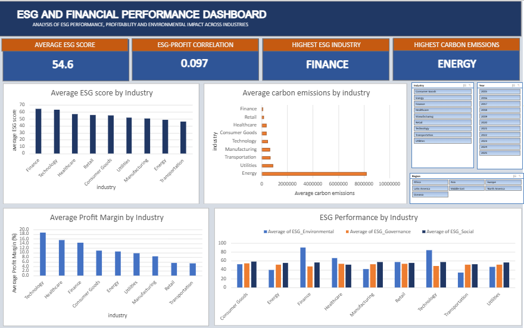

# ESG and Financial performance analysis 
## project 

This project investigates the relationship between environmental, social and governance (ESG) performance and financial performance using a simulated dataset of companies. 

The question investigated was: 
 is there a relationship between a company's ESG performance and its financial performance 

The analysis was completed on Excel and SQL, with results presented on a excel dashboard 
 tools used 
- Excel - data organisation, pivot tables, analysis, charts and dashboard
- SQL - aggregation, grouping, sorting and correlation analysis
- GitHub - project documentation

## questions 
1. Which industries have the highest average ESG scores?
2. Is ESG performance related to financial performance?
3. Which industries have the highest carbon emissions?
4. Does company size appear related to ESG performance?
5. Are there interesting differences between ESG performance and profitability?

## findings 
- Finance had the highest average overall ESG score at 64.6
- Transportation had the lowest average ESG score at 46.0
- Technology had the highest average profit margin at 18.8%
- Energy had by far the highest average carbon emissions.
- The company level correlation between average ESG score and average profit margin was 0.097, suggesting little to no linear relationship between the two variables in the dataset.

## Limitation
The dataset contains simulated company data, so the findings should not be treated as representative of real-world companies.
Correlation does not prove causation. The analysis also found that factors such as company size and industry can affect how ESG and carbon-emission figures should be interpreted.

## Project Outputs 
- Excel analysis and dashboard
- SQL analysis
- written project report
- dataset used for the analysis

## Dashboard

 
